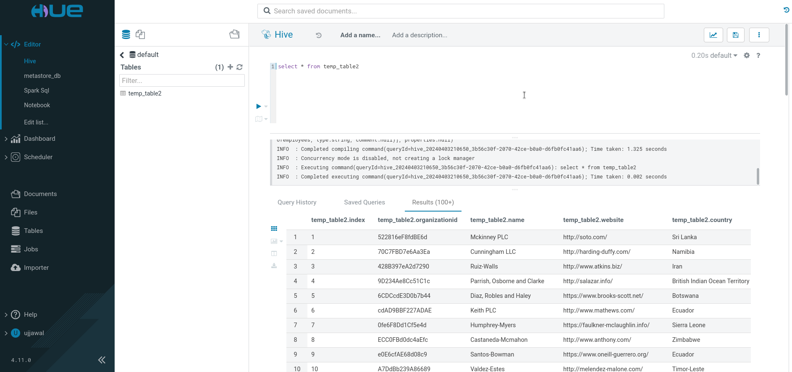
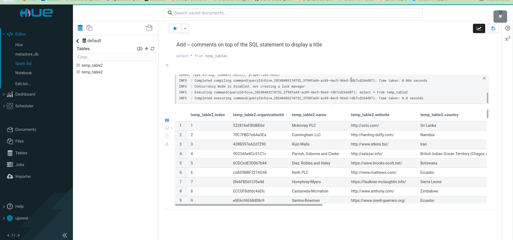
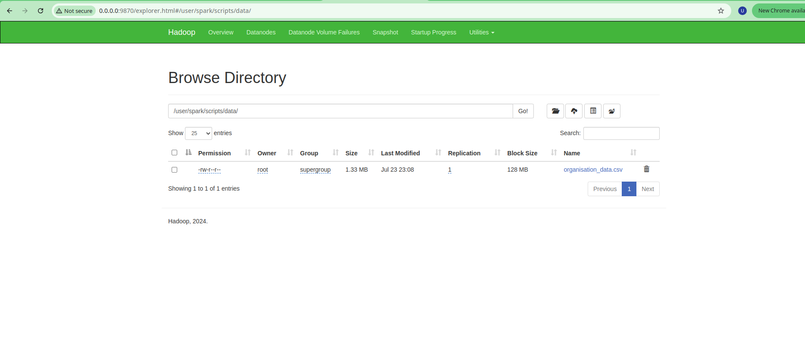
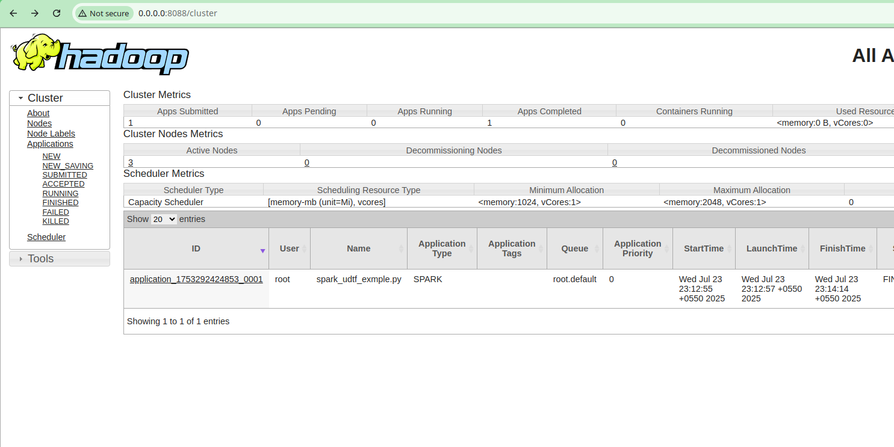

### Hive Read and write using spark 

```bash
docker-compose up 
docker exec -it spark-master bash
cd home/spark-jobs/
spark-submit spark_job.py
```

### Metastore db 
telnet metastore 9083

### HiveServer 
telnet hiveserver2 10000

### Hue Server 
telnet hue 8888

#### Hue Conf 

[Hue url](http://0.0.0.0:11004/hue/editor/?type=hive)

Default Password is -> password 
Default User Name is -> Ujjawal

In order to update password delete hue.ini/desktop.db

### ScreenShots 

Hue Postgres 


Hue Hive Server 



Hue Spark sql



### Required spark-submit Commands
spark-submit   --master yarn   --deploy-mode cluster   --conf spark.yarn.appMasterEnv.PYSPARK_PYTHON=python3   --conf spark.executorEnv.PYSPARK_PYTHON=python3   hdfs:///user/spark/scripts/spark_udf_test.py

### Required HDFS command
hdfs dfs -mkdir -p /user/spark/scripts

hdfs dfs -put spark_udf_test.py /user/spark/scripts

hdfs dfs -rm /user/spark/scripts/spark_udf_test.py



### Required Yarn command
yarn application -list -appStates ALL

yarn logs -applicationId <application_id>



### spark yarn setup confirmation

dcexec spark-master jps -> DataNode, Master
dcexec spark-worker-1 jps -> Worker, DataNode
dcexec spark-worker-2 jps -> Worker, DataNode
dcexec namenode jps -> NameNode, ResourceManager

Special rule for ThriftServer
Spark hard-codes: “Cluster deploy mode is not applicable to Spark Thrift server.”
So the ThriftServer must be started in client mode; executor containers still run on the worker nodes.


```python
>>> from pyspark.sql.functions import *
>>> df.withColumn("event_time", expr("cast(unix_timestamp(current_timestamp()) * 1000 as long)")).coalesce(1).write.mode("overwrite").parquet("hdfs://namenode:8020/user/airflow/organisation/")
```

sbt clean assembly


spark-submit   --class com.custom_pinot_ingestion.test.PinotSparkIngestion   --master local[*] --jars pinot-all-1.4.0-jar-with-dependencies.jar,pinot-hdfs-1.4.0-shaded.jar --files jobSpec.yaml  spark_udf_test_jvm/target/scala-2.13/spark_udf_test_jvm-assembly-0.1.0-SNAPSHOT.jar


spark-submit \
  --master local[*] \
  --conf "spark.driver.extraJavaOptions=-Dplugins.dir=/home/spark-jobs/spark_scala_project/apache-pinot-1.4.0-bin/plugins" \
  --conf "spark.executor.extraJavaOptions=-Dplugins.dir=/home/spark-jobs/spark_scala_project/apache-pinot-1.4.0-bin/plugins" \
  --conf "spark.pinot.auth.token=YWRtaW46dmVyeXNlY3JldA" \
  --jars pinot-all-1.4.0-jar-with-dependencies.jar \
  --files jobSpec.yaml,organisation_data.json,organisation_table.json \
  --class com.custom_pinot_ingestion.test.PinotSparkIngestion \
  spark_udf_test_jvm/target/scala-2.13/spark_udf_test_jvm-assembly-0.1.0-SNAPSHOT.jar
