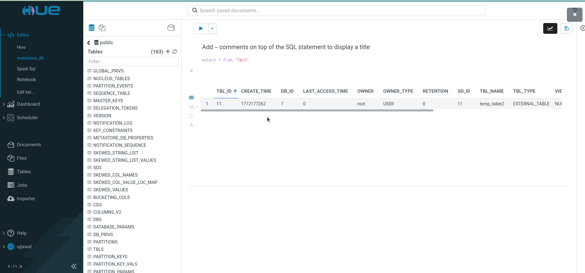

### Hive Read and write using spark 

```bash
docker-compose up 
docker exec -it spark-master bash
cd home/spark-jobs/
spark-submit spark_job.py
```

### Metastore db 
telnet metastore 9083

### HiveServer 
telnet hiveserver2 10000

### Hue Server 
telnet hue 8888

#### Hue Conf 

[Hue url](http://0.0.0.0:11004/hue/editor/?type=hive)

Default Password is -> password 
Default User Name is -> Ujjawal

In order to update password delete hue.ini/desktop.db

### ScreenShots 

Hue Postgres 



Hue Hive Server 


Hue Spark sql


### Required spark-submit Commands
spark-submit   --master yarn   --deploy-mode cluster   --conf spark.yarn.appMasterEnv.PYSPARK_PYTHON=python3   --conf spark.executorEnv.PYSPARK_PYTHON=python3   hdfs:///user/spark/scripts/spark_udf_test.py

### Required HDFS command
hdfs dfs -mkdir -p /user/spark/scripts

hdfs dfs -put spark_udf_test.py /user/spark/scripts

hdfs dfs -rm /user/spark/scripts/spark_udf_test.py


### Required Yarn command
yarn application -list -appStates ALL

yarn logs -applicationId <application_id>


### spark yarn setup confirmation

dcexec spark-master jps -> DataNode, Master
dcexec spark-worker-1 jps -> Worker, DataNode
dcexec spark-worker-2 jps -> Worker, DataNode
dcexec namenode jps -> NameNode, ResourceManager

Special rule for ThriftServer
Spark hard-codes: “Cluster deploy mode is not applicable to Spark Thrift server.”
So the ThriftServer must be started in client mode; executor containers still run on the worker nodes.